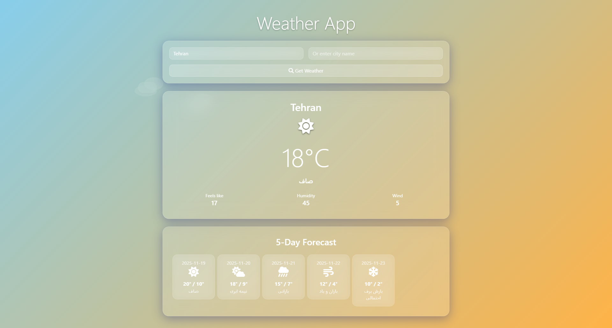
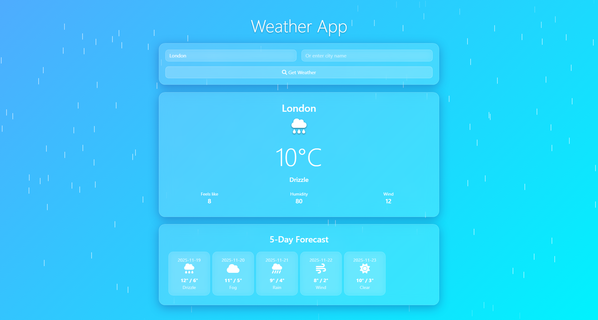
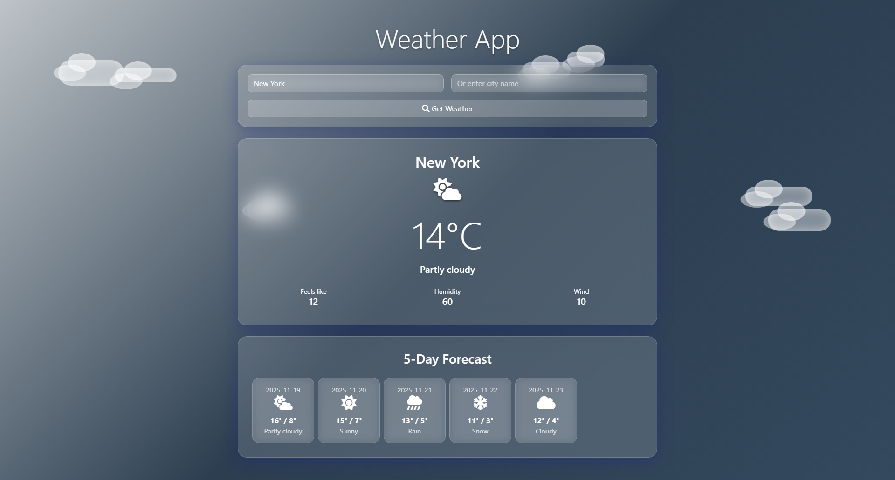

# 🌟 Weather Glass App

برنامه‌ای زیبا و مدرن برای نمایش وضعیت آب‌وهوا با طراحی شیشه‌ای (Glassmorphism) و بک‌گراند پویا که بر اساس شرایط جوی تغییر می‌کند.

## 📖 مقدمه

Weather Glass App یک برنامه تک‌صفحه‌ای وب برای نمایش وضعیت آب‌وهوا است که توسط فناوری‌های مدرن ساخته شده و تجربه‌ای بصری جذاب ارائه می‌دهد. این برنامه به علت عدم دسترسی به API‌های آب‌وهوایی خارجی، از داده‌های Mock استفاده می‌کند. نحوه طراحی شیشه‌ای (Glassmorphism) با استفاده از blur و شفافیت، ظاهر مدرن و حرفه‌ای‌ای ایجاد کرده است. بک‌گراند برنامه به صورت پویا با شرایط جوی (آفتابی، ابری، بارانی، برفی، طوفانی، مه‌آلود، شب) تغییر می‌کند و انیمیشن‌های مختلفی همچون قطرات باران، دانه‌های برف و ستاره‌ها را نمایش می‌دهد.

## 🛠️ تکنولوژی‌ها و ابزارهای استفاده‌شده

### Backend
- **Node.js**: محیط اجرای جاوا اسکریپت سمت سرور
- **Express**: فریمورک وب برای ساخت API
- **Mock JSON**: داده‌های نمونه آب‌وهوا برای توسعه بدون API خارجی
- **Supertest**: ابزار تست اتوماتیک API‌ها

### Frontend
- **HTML/CSS/JavaScript**: ساختار اصلی وب‌سایت
- **Bootstrap**: فریمورک CSS برای طراحی ریسپانسیو
- **Font Awesome**: آیکون‌های آب‌وهوا
- **SweetAlert2**: نمایش پیام‌های جذاب هنگام خطا
- **CDN**: استفاده از فایل‌های آنلاین برای کاهش حجم

### Testing
- **Jest**: فریمورک تست جاوا اسکریپت
- **Supertest**: تست API‌های وب

### UI/UX Features
- **Blur Effects**: افکت‌های شیشه‌ای با blur میرایی
- **Glassmorphism**: طراحی مدرن با گوشه‌های گرد و لبه‌های شفاف
- **Responsive Layout**: سازگار با موبایل، تبلت و دسکتاپ
- **Animated Background**: انیمیشن‌های پویا برای هر شرایط جوی

## 🖼️ اسکرین‌شات‌ها

### صفحه اصلی آفتابی (تهران)


### حالت بارانی (لندن)


### حالت ابری (نیویورک)


## 📁 ساختار پروژه

```
weather-glass-app/
├─ .gitignore
├─ README.md
├─ package.json
├─ server.js
├─ /controllers
│ └─ weatherController.js
├─ /routes
│ └─ weather.js
├─ /data
│ └─ mockWeather.json
├─ /public
│ ├─ index.html
│ ├─ /css
│ │ └─ styles.css
│ └─ /js
│   └─ main.js
└─ /tests
  └─ weather.test.js
```

## 🚀 نحوه نصب و اجرا

### پیش‌نیازها
- Node.js نسخه ۱۸+
- npm یا yarn

### نصب بسته‌ها
```bash
npm install
```

### اجرای حالت توسعه (با nodemon)
```bash
npm run dev
```
برنامه روی [http://localhost:3000](http://localhost:3000) اجرا می‌شود.

### اجرای حالت تولید
```bash
npm start
```

### اجرای تست‌ها
```bash
npm test
```

## 📡 API Endpoints

| مسیر | متد | توضیحات |
|------|------|---------|
| `/api/weather/current?city={cityName}` | GET | وضعیت فعلی آب‌وهوا شهر مشخص |
| `/api/weather/forecast?city={cityName}` | GET | پیش‌بینی ۵ روزه آب‌وهوا |
| `/api/weather/cities` | GET | لیست شهرهای پشتیبانی‌شده |

*نکته: همه APIها از داده‌های Mock (مشق) استفاده می‌کنند و از `data/mockWeather.json` خوانده می‌شوند.*

## ✨ ویژگی‌ها (Features)

- **🎨 طراحی شیشه‌ای**: ظاهر مدرن با blur و transparent backdrop
- **🌤️ بک‌گراند پویا**: تغییر خودکار رنگ و انیمیشن بر اساس شرایط جوی
- **💧 افکت‌های باران/برف/مه**: قطرات باران/cells، دانه‌های برف حمله و حرکت سازگار با شرایط
- **📱 ریسپانسیو**: طراحی سازگار با تمام دستگاه‌ها
- **🐐 Mock API**: داده‌های نمونه بدون نیاز به API خارجی
- **🧪 Jest Testing**: پوشش تست کامل با Supertest
- **🌙 حالت شب**: ستاره‌های twinkling در بک‌گراند شب

## 🔮 توسعه آینده (Future Improvements)

- **🔗 اتصال API واقعی**: یکپارچه‌سازی با OpenWeather برای داده‌های واقعی
- **🗺️ نمایش نقشه**: وضعیت دما روی نقشه تعاملی
- **🕐 حالت شب اتوماتیک**: تشخیص زمان سیستم برای تغییر به شب
- **📍 موقعیت مکانی**: دریافت اتوماتیک موقعیت جغرافیایی
- **🌍 چندزبانی**: پشتیبانی از زبان‌های مختلف
- **📈 نمودار پیش‌بینی**: گرافیک‌های پیشرفته برای پیش‌بینی


🌟 اگر سؤالی دارید یا پیشنهادی برای بهبود دارید، خوشحال می‌شوم بشنوم!
